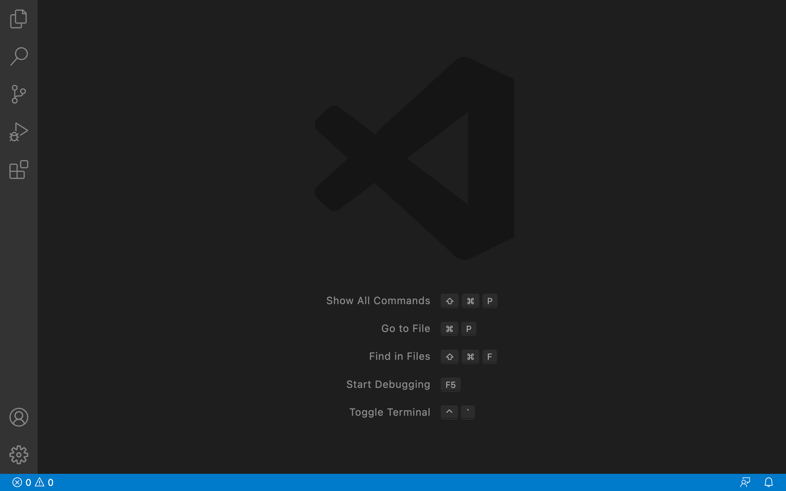

# Lab Report 1

## Step 1: Install VS Code

- Visit the [Visual Studio Code website](https://code.visualstudio.com)
- Follow downloading and set up instructions for particular operating system (OSX or Windows)
- To verify that VS Code has succesfully been installed, open a window on the app. Your screen should look similar to the image below. 

2. Remotely Connecting

3. Trying some commands
