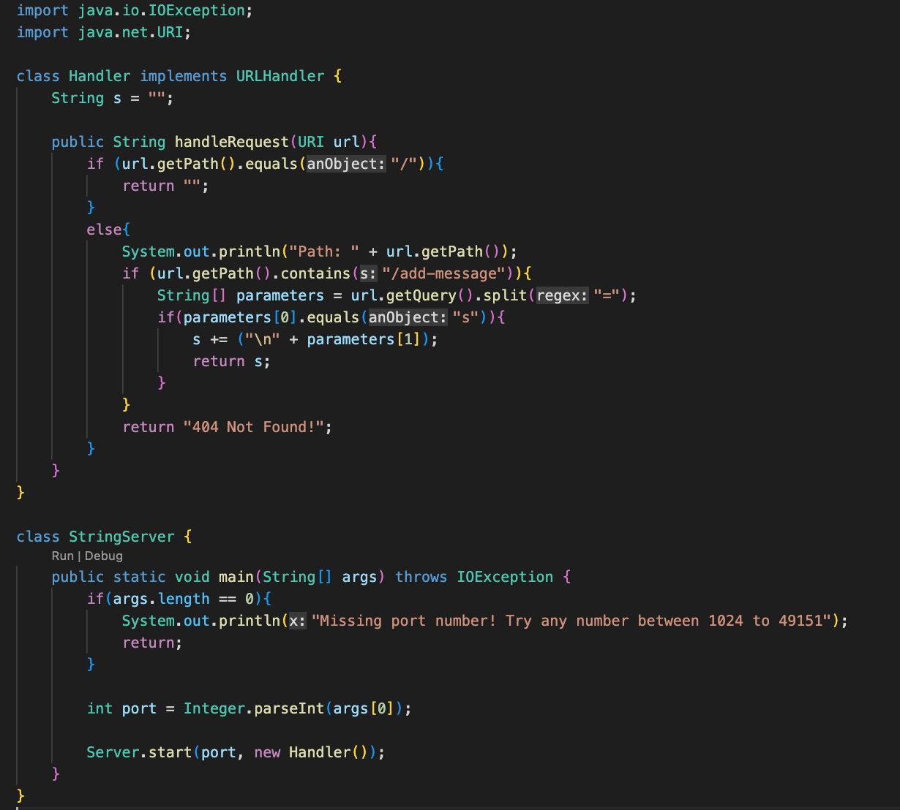
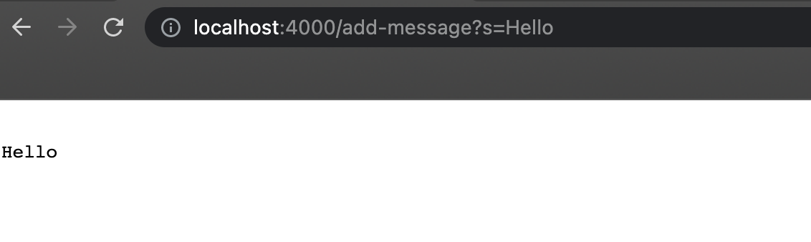
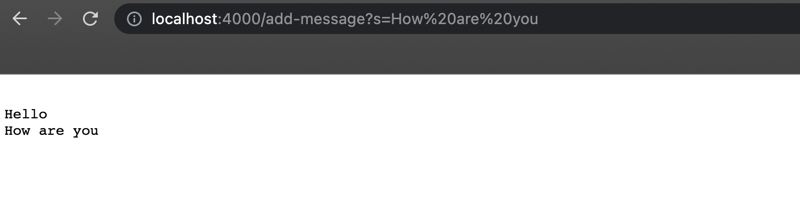
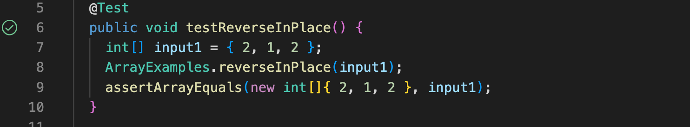

# Lab Report 2

## Part 1

**Code for StringServer:**

**Screenshot #1:**

- The method that is called in the link above is the `handleRequest(URI url)` method. 
- The only argument in the `handRequest` method is the url of the server.
- The value of `string` changes and "hello" is added to the String variable through the "add-message" command in the argument.

**Screenshot #2:**

- The method that is called in the link above is the `handleRequest(URI url)` method. 
- The only argument in the `handRequest` method is the url of the server.
- The value of the `string` variable is updated from "hello" to "hello how are you" with "how are you" printed on the next line through the "add-message" command in the argument.

## Part 2

I chose the `ArrayExamples.java` file to debug.

**Method #1: `reverseInPlace(int[] arr)`**

***Failure-Inducing Input & Respective Symptom***

One failure-inducing input for the reverseInPlace method is: 

	@Test
	public void testReverseInPlace(){
	    int[] input1 = { 3, 10, 4 };
	    ArrayExamples.reverseInPlace(input1);
	    assertArrayEquals(new int[]{ 3, 10, 4 }, input1);
	}
      

Below is the respective output or symptom of the test written above:

	arrays first differed at element [0]; expected:[3] but was:[10]
 	at ArrayTests.testReverseInPlace(ArrayTests.java:9)
	Caused by: java.lang.AssertionError: expected:[3] but was:[10]
	 ... 29 more

 ***Non-Failure-Inducing Input***

	@Test
	public void testReverseInPlace(){
	    int[] input1 = { 2, 1, 2 };
	    ArrayExamples.reverseInPlace(input1);
	    assertArrayEquals(new int[]{ 2, 1, 2 }, input1);
	}
	
The test above passed the method with as shown in the screenshot below:

