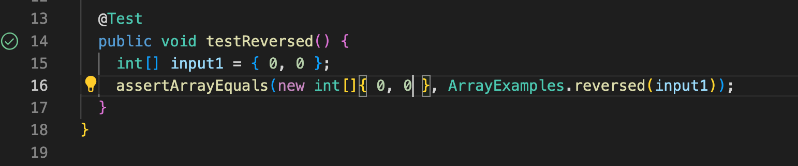

# Lab Report 2

## Part 1

**Code for StringServer:**

**Screenshot #1:**

- The method that is called in the link above is the `handleRequest(URI url)` method. 
- The only argument in the `handRequest` method is the url of the server.
- The value of `string` changes and "hello" is added to the String variable through the "add-message" command in the argument.

**Screenshot #2:**

- The method that is called in the link above is the `handleRequest(URI url)` method. 
- The only argument in the `handRequest` method is the url of the server.
- The value of the `string` variable is updated from "hello" to "hello how are you" with "how are you" printed on the next line through the "add-message" command in the argument.

## Part 2

I chose the `ArrayExamples.java` file to debug.

**Method #1: `reverseInPlace(int[] arr)`**

***Failure-Inducing Input & Respective Symptom***

One failure-inducing input for the reverseInPlace method is: 

	@Test
	public void testReverseInPlace(){
	    int[] input1 = { 3, 10, 4 };
	    ArrayExamples.reverseInPlace(input1);
	    assertArrayEquals(new int[]{ 3, 10, 4 }, input1);
	}
      

Below is the respective symptom of the test written above:

	arrays first differed at element [0]; expected:[3] but was:[10]
 	at ArrayTests.testReverseInPlace(ArrayTests.java:9)
	Caused by: java.lang.AssertionError: expected:[3] but was:[10]
	 ... 29 more

 ***Non-Failure-Inducing Input***

	@Test
	public void testReverseInPlace(){
	    int[] input1 = { 2, 1, 2 };
	    ArrayExamples.reverseInPlace(input1);
	    assertArrayEquals(new int[]{ 2, 1, 2 }, input1);
	}
	
The test above passed the method, as shown in the screenshot below:

**Method #2: `reversed(int[] arr)`**

***Failure-Inducing Input & Respective Symptom***

One failure-inducing input for the reversed method is: 

	@Test
	public void testReversed() {
	   int[] input1 = { 2, 7, 9 };
	   assertArrayEquals(new int[]{ 2, 7, 9 }, ArrayExamples.reversed(input1));
	}

Below is the respective symptom of the test written above:

	arrays first differed at element [0]; expected:[2] but was:[0]
 	at ArrayTests.testReversed(ArrayTests.java:16)
	Caused by: java.lang.AssertionError: expected:[2] but was:[0]
 	... 29 more
	
***Non-Failure-Inducing Input***

	@Test
	public void testReversed() {
	   int[] input1 = { 0, 0 };
	   assertArrayEquals(new int[]{ 0, 0 }, ArrayExamples.reversed(input1));
	}
	
The test above passed the method, as shown in the screenshot below:

**Fixing File `ArrayExamples.java`**

***Original Code for both methods***

	static void reverseInPlace(int[] arr) {
    	   for(int i = 0; i < arr.length; i += 1) {
      	      arr[i] = arr[arr.length - i - 1];
    	   }
  	}

  	static int[] reversed(int[] arr) {
    	   int[] newArray = new int[arr.length];
    	   for(int i = 0; i < arr.length; i += 1) {
      	      arr[i] = newArray[arr.length - i - 1];
    	   }
    	   return arr;
  	}

***Debugged Codes for both methods***

	static void reverseInPlace(int[] arr) {
    	   for(int i = 0; i < (arr.length/2); i += 1) {
      	      arr[i] = arr[arr.length - i - 1];
	      int prevValue = arr[i];
	      arr[arr.length - i - 1] = prevValue;
    	   }
  	}

  	static int[] reversed(int[] arr) {
    	   int[] newArray = new int[arr.length];
    	   for(int i = 0; i < arr.length; i += 1) {
	      newArray[i] = arr[arr.length - i - 1];
    	   }
    	   return newArray;
  	}

The failure-inducing input for the `reverseInPlace(int[] arr)` method was any array that was no a mirror image sequence. To debug, I changed the for loop condition to arr.length/2 and added a int value that stored the previous value of the array and then replaced the values at the other end of th array with that previous value. 
The failure-inducing input for the `reversed(int[] arr)` method was any non-zero array. To debug, I switched the arr and newArray. Specifically, I replaced arr[i] with newArray[i] and newArray[arr.length - i - 1] with arr[arr.length - i - 1].

## Part 3

I learnt more about web servers and URLs. More specifically, I learnt how to create a web server and understood the different components of a URL. I'm completely new to computer science and this is only the second computer science course I've taken, so I find it very interesting to undertstand the basics of the technology and logistics behind things we use everyday. I also learnt more about testing and JUnit in particular, I find that to be very useful and am hoping to continue to use it later on in my coding career. Heading in the direction of software engineering, learning how to debug code is also a very useful skill I'm grateful I learnt in labs 2 and 3. 
