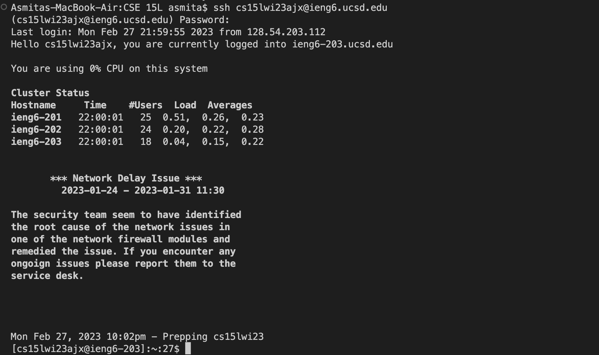
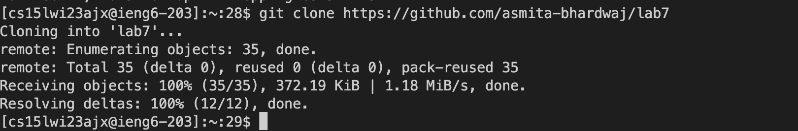
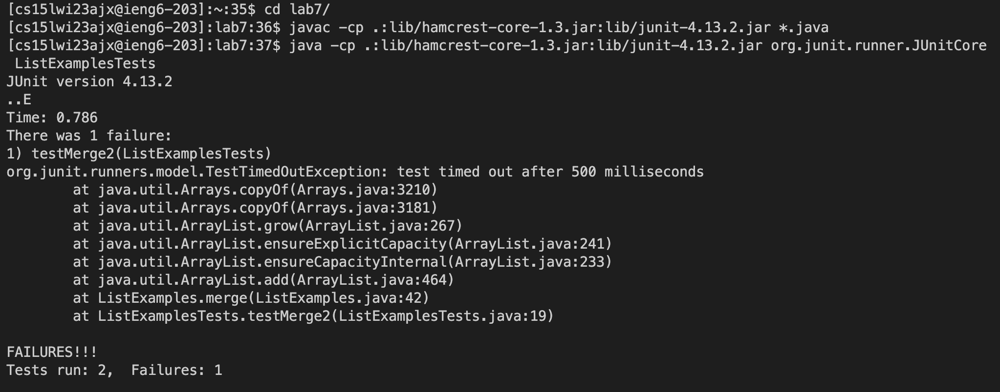
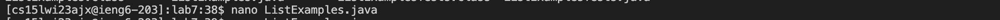
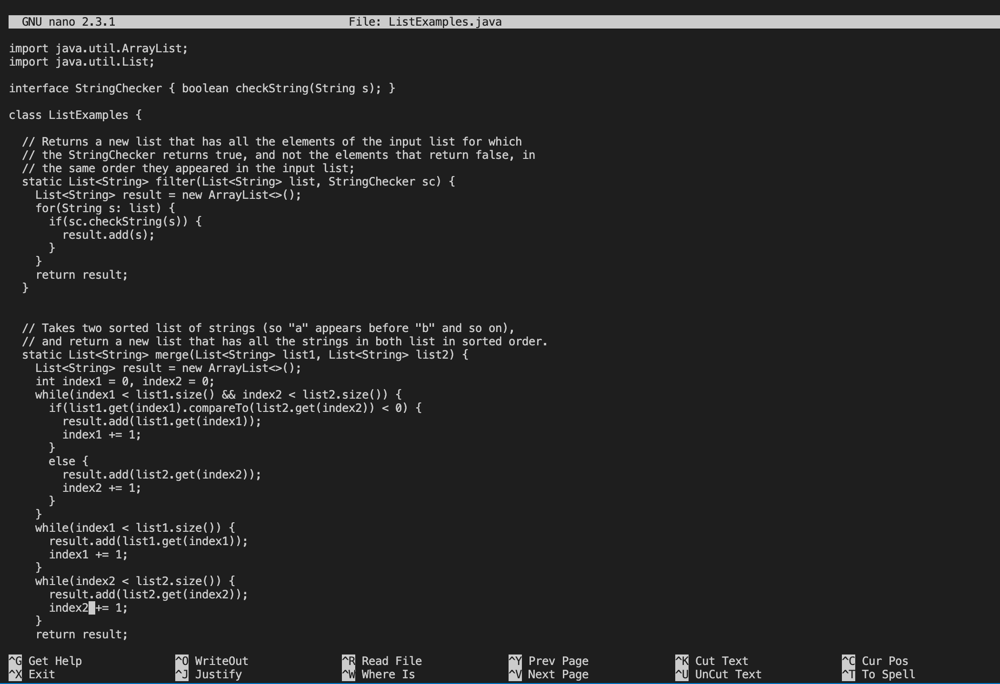
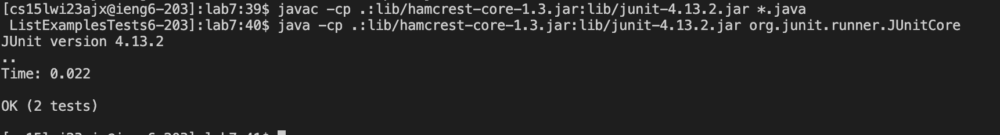

# Lab Report 4

## Step 1: Logging into ieng6

- I first typed ssh cs15lwi23ajx@ieng6.ucsd.edu and then pressed <enter>
- Then I entered my password

 
  
## Step 2: Cloning my fork of the repository from my Github account
  
    Keys Pressed: <Ctrl-R><git><enter>
  
I used the Ctrl-R command to search for the git cloning command by typing "git". Then, when I found the command I pressed enter. Below is the terminal after cloning the repository:
  

  

## Step 3: Run the tests, demonstrating that they fail

    Keys Pressed: <cd l><tab><enter>, <Ctrl-R><javac><enter>, <Ctrl-R><java -cp><enter>

First, I typed cd l and pressed tab and enter to run the cd lab7/ command to change directories.
Then, I used the Ctrl-R command to search for the compiler command by typing "javac". Then, when I found the command I pressed enter.
Then, I used the Ctrl-R command to search for the command to run by typing "java -cp". Then, when I found the command I pressed enter. 
Below is the terminal after running the tests:
  

## Step 4: Editing the code file to fix the failing test

    First, I typed in nano ListExamples.java and pressed <enter>
    Keys Pressed: <Ctrl-W><result.add><enter>, <Ctrl-E><left><left><lefte><delete><delete><delete>
    Then I scrolled to the end of the file to the last while loop and:
    Keys Pressed: <down><down><right><right><right><right><right><right><right><right><delete><2>, <Ctrl-O><enter>, <Ctrl-X>
  
Below is the terminal when running the nano command as well as the edited version of the file to fix the failing test:
  
  
  
  
  

## Step 5: Running the tests, demonstrating that they now succeed
  
      Keys Pressed: <up><up><up><up><enter>, <up><up><up><up><enter>
 
Since I recently run the tests I simply pressed the up buttonn four times before reaching the proper commands while both compiling and running, then I pressed enter. The results of the tests are below:
  
  
